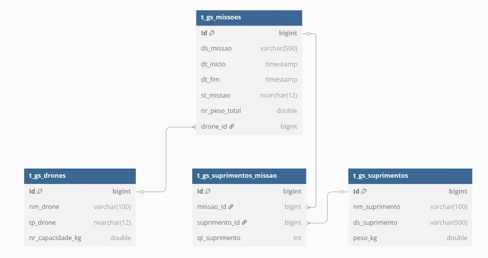

# GSDrones - Sistema de Gerenciamento de Drones

O Sistema de Gerenciamento de Drones é uma aplicação web completa desenvolvida em C# ASP.NET Core que permite o controle e monitoramento de drones para missões de entrega de suprimentos. O sistema oferece funcionalidades para cadastro de drones, criação de missões, gerenciamento de suprimentos e controle de operações.

## 🚀 Funcionalidades

### Gerenciamento de Drones
- **Cadastro de Drones**: Registro de drones com informações como nome, tipo e capacidade de carga
- **Tipos de Drone**: Suporte para diferentes tipos (MEDICAMENTOS, CARGA, RESGATE)
- **Controle de Capacidade**: Validação de peso máximo suportado

### Gerenciamento de Missões
- **Criação de Missões**: Planejamento de missões com descrição e drone designado
- **Status de Missão**: Controle de status (EM_ANDAMENTO, CONCLUIDO, CANCELADO)
- **Gestão de Suprimentos**: Associação de suprimentos às missões com controle de quantidade
- **Validação de Peso**: Verificação automática da capacidade do drone vs peso total da missão

### Gerenciamento de Suprimentos
- **Cadastro de Suprimentos**: Registro de suprimentos com nome, descrição e peso
- **Integração com Missões**: Associação dinâmica de suprimentos às missões

## 🛠️ Tecnologias Utilizadas

- **Framework**: ASP.NET Core
- **Linguagem**: C#
- **Arquitetura**: REST API
- **Padrão**: Repository/Service Pattern
- **Validação**: Data Annotations
- **Documentação**: Swagger/OpenAPI

## 📋 Pré-requisitos

- .NET 6.0 ou superior
- Visual Studio 2022 ou VS Code
- Entity Framework Core (Oracle)
- Postman ou similar para testes de API

## 🚀 Instalação e Configuração

### 1. Clone o repositório
```bash
git clone https://github.com/seu-usuario/gsdrones.git
cd gsdrones
```

### 2. Restaure as dependências
```bash
dotnet restore
```

### 3. Configure o banco de dados
```bash
# Crie as migrations (se necessário)
dotnet ef migrations add InitialCreate

# Atualize o banco de dados
dotnet ef database update
```

### 4. Execute a aplicação
```bash
dotnet run
```

A aplicação estará disponível em `http://localhost:5199`

## 📚 Desenvolvimento

### Padrões Utilizados

**DTOs (Data Transfer Objects)**
- Separação entre dados de entrada (`RequestDTO`) e saída (`ResponseDTO`)
- Validações usando Data Annotations
- Mapeamento manual entre DTOs e Models

**Controllers**
- Implementação de operações CRUD completas
- Padronização de responses HTTP
- Tratamento de erros com códigos de status apropriados

**Services**
- Encapsulamento da lógica de negócio
- Validações de domínio
- Integração com repositórios

## 🧩 Diagrama de Classes



## 🎙️Vídeo Pitch

Link: 

## 🧪 Testes

### Configuração do Ambiente de Testes

Acesse a documentação Swagger em: `http://localhost:5199/swagger/index.html`

### Exemplos de Testes com Postman/curl

#### 1. Cadastro de Drone
```bash
# POST /api/Drone
curl -X POST "http://localhost:5199/api/Drone" \
-H "Content-Type: application/json" \
-d '{
  "nome": "Drone Medical 01",
  "tipo": "MEDICAMENTOS",
  "capacidadeKg": 10.5
}'
```

**Response esperado:**
```json
{
  "id": 1,
  "nome": "Drone Medical 01",
  "tipo": "MEDICAMENTOS",
  "capacidadeKg": 10.5
}
```

#### 2. Cadastro de Suprimento
```bash
# POST /api/Suprimento
curl -X POST "http://localhost:5199/api/Suprimento" \
-H "Content-Type: application/json" \
-d '{
  "nome": "Medicamento Básico",
  "descricao": "Kit de primeiros socorros completo",
  "pesoKg": 2.5
}'
```

**Response esperado:**
```json
{
  "id": 1,
  "nome": "Medicamento Básico",
  "descricao": "Kit de primeiros socorros completo",
  "pesoKg": 2.5
}
```

#### 3. Criação de Missão
```bash
# POST /api/Missao
curl -X POST "http://localhost:5199/api/Missao" \
-H "Content-Type: application/json" \
-d '{
  "descricao": "Entrega de medicamentos na zona rural",
  "droneId": 1,
  "suprimentos": [
    {
      "suprimentoId": 1,
      "quantidade": 3
    }
  ]
}'
```

**Response esperado:**
```json
{
  "id": 1,
  "descricao": "Entrega de medicamentos na zona rural",
  "status": "EM_ANDAMENTO",
  "dataInicio": "2025-06-08T10:30:00",
  "dataFim": null,
  "drone": {
    "id": 1,
    "nome": "Drone Medical 01",
    "tipo": "MEDICAMENTOS",
    "capacidadeKg": 10.5
  },
  "suprimentos": [
    {
      "suprimento": {
        "id": 1,
        "nome": "Medicamento Básico",
        "descricao": "Kit de primeiros socorros completo",
        "pesoKg": 2.5
      },
      "quantidade": 3
    }
  ],
  "pesoTotal": 7.5
}
```

#### 4. Listagem de Drones
```bash
# GET /api/Drone
curl -X GET "http://localhost:5199/api/Drone"
```

#### 5. Conclusão de Missão
```bash
# PATCH /api/Missao/1/concluir
curl -X PATCH "http://localhost:5199/api/Missao/1/concluir"
```

#### 6. Cancelamento de Missão
```bash
# DELETE /api/Missao/1
curl -X DELETE "http://localhost:5199/api/Missao/1"
```

### Cenários de Teste

#### Testes de Validação
1. **Drone com nome vazio** - Deve retornar erro 400
2. **Drone com capacidade negativa** - Deve retornar erro 400
3. **Tipo de drone inválido** - Deve retornar erro 400
4. **Missão com peso superior à capacidade do drone** - Deve retornar erro 400

#### Testes de Integração
1. **Criação completa de missão** - Drone + Suprimentos + Missão
2. **Fluxo completo de missão** - Criar → Executar → Concluir
3. **Cancelamento de missão** - Validar alteração de status

#### Testes de Erro
1. **Busca por ID inexistente** - Deve retornar 404
2. **Atualização de recurso inexistente** - Deve retornar 404
3. **Exclusão de recurso inexistente** - Deve retornar 404

### Validações Implementadas

- **Drones**: Nome obrigatório (máx. 100 chars), tipo válido, capacidade > 0
- **Suprimentos**: Nome obrigatório (máx. 100 chars), descrição (máx. 500 chars), peso > 0
- **Missões**: Descrição obrigatória (máx. 100 chars), drone válido, suprimentos com quantidade > 0

## 📖 Documentação da API

Após executar a aplicação, acesse a documentação interativa:
- **Swagger UI**: `http://localhost:5199/swagger/index.html`
